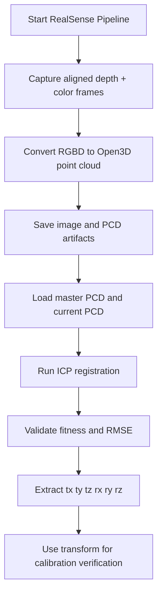

# RealSense 3D Calibration with Open3D ICP

A portfolio case-study project demonstrating an industrial 3D vision calibration workflow using Intel RealSense depth/color capture, Open3D point-cloud generation, and ICP-based alignment between a current scan and a master reference scan.

> This repository is a sanitized portfolio version. It does not contain customer data, production images, camera serial numbers, PLC IP addresses, credentials, or proprietary configuration.

## Project Summary

This project demonstrates a 3D calibration pipeline for an industrial inspection system where a current point cloud is compared against a master/reference point cloud. The system computes a 4x4 transformation matrix and extracts translation/rotation values that can be used for calibration verification, offset monitoring, or downstream robot/inspection correction.

## Problem Solved

In real production, a part or fixture can shift slightly from the trained master position. For 3D inspection, this causes point-cloud mismatch and unreliable measurement. This project shows how a current RealSense capture can be converted into a point cloud and aligned with a master point cloud using ICP registration.

## Key Features

- Intel RealSense depth and color stream pipeline
- Aligned depth/color frame capture
- RGBD image to Open3D point-cloud conversion
- Snapshot artifact saving for image and `.pcd` data
- ICP registration from current scan to master scan
- Fitness and RMSE quality validation
- Translation and rotation extraction from transformation matrix
- Hardware-driver lifecycle abstraction
- Thread-safe camera grab and streaming pattern

## Technology Stack

| Area | Tools / Concepts |
|---|---|
| Language | Python |
| 3D Vision | Intel RealSense, depth frame, color frame, RGBD |
| Point Cloud | Open3D |
| Registration | ICP, point-to-point, point-to-plane concept |
| Math | 4x4 transformation matrix, Euler angle extraction |
| Driver Layer | Base driver, connection lifecycle, thread lock |
| Reliability | Fitness/RMSE threshold validation |

## Repository Structure

```text
realsense-3d-calibration-icp/
├── README.md
├── src/
│   └── threed_calibration/
│       ├── vision_capability.py
│       ├── point_cloud_3d.py
│       ├── rscam_driver.py
│       ├── base_driver.py
│       ├── driver_exception.py
│       └── realsense/
│           ├── rs_pipeline.py
│           └── rs_processing.py
├── docs/
├── samples/
├── tests/
├── requirements.txt
└── .gitignore
```

## High-Level Flow



## Main Modules

| Module | Purpose |
|---|---|
| `vision_capability.py` | Saves artifacts and computes current-to-master ICP transform |
| `point_cloud_3d.py` | Open3D point-cloud construction, ICP registration, transform extraction |
| `rs_pipeline.py` | Intel RealSense pipeline start/stop and aligned frame capture |
| `rs_processing.py` | Converts RealSense frames into image + point cloud |
| `rscam_driver.py` | Driver lifecycle wrapper for connect, disconnect, grab, stream |
| `base_driver.py` | Unified connection state and thread lock |
| `driver_exception.py` | Hardware-driver exception model |

## Example Result

```json
{
  "rotation_angles": {
    "tx": 0.003,
    "ty": -0.001,
    "tz": 0.006,
    "rx": 0.12,
    "ry": -0.05,
    "rz": 0.30
  },
  "fitness": 0.82,
  "inlier_rmse": 0.006,
  "identity_transform": false
}
```

## How to Run

Install dependencies:

```bash
pip install -r requirements.txt
```

Run tests:

```bash
pytest
```

Use with RealSense hardware:

```python
from threed_calibration.rscam_driver import RSCamDriver
from threed_calibration.vision_capability import ThreeDVisionCapability

camera = RSCamDriver(width=848, height=480, config_file="config_3.json")
camera.connect()
snapshot = camera.grab()

capability = ThreeDVisionCapability()
capability.save_snapshot_artifacts(snapshot)
result = capability.compute_transform(master_pcd="samples/master_reference.pcd")
print(result)
camera.disconnect()
```

## Industrial Relevance

This project is relevant for:

- 3D camera calibration
- robot/cobot inspection systems
- fixture/part shift detection
- current-vs-master point-cloud verification
- daily calibration monitoring
- smart manufacturing inspection workflows

## Confidentiality Note

The project is sanitized for portfolio use. No real production images, machine configuration, credentials, customer names, camera serial numbers, or factory network details are included.

## Author

Akash K  
Industrial Automation & Robotics Software Engineer  
Python | 3D Vision | RealSense | Open3D | Cobot Integration | Industrial Inspection
